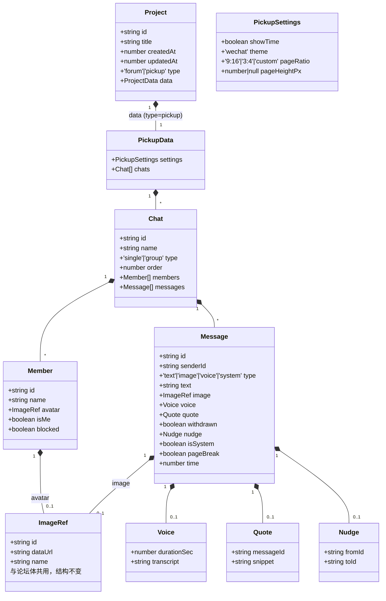
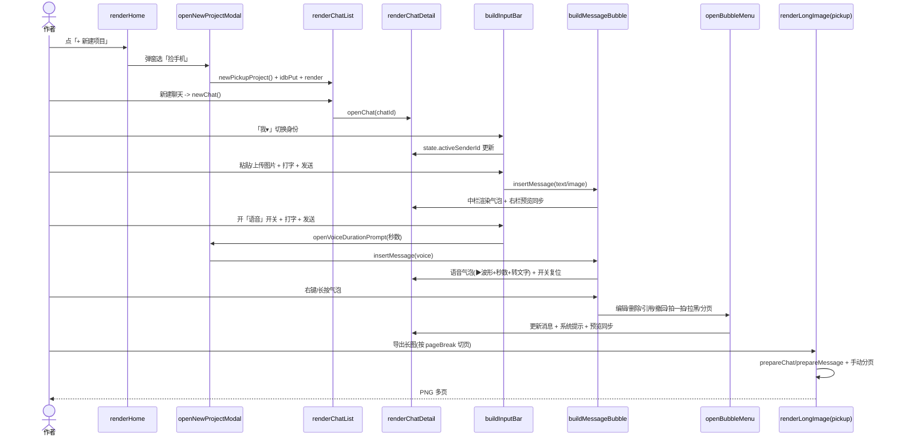
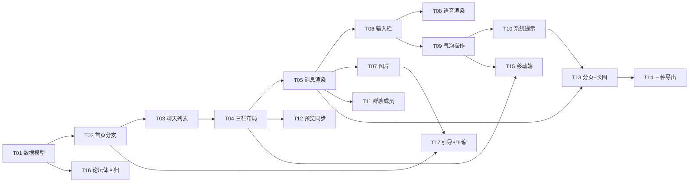

# 捡手机文学 · 系统架构设计 + 任务分解

> 文档类型：架构设计 + 任务分解（增量开发，不改 `index.html` 业务代码，本文档为新增设计依据）
> 作者：架构师 高见远
> 日期：2026-07-13
> 目标：在现有单文件 `index.html`（vanilla JS / 零依赖 / IndexedDB）内，新增「捡手机文学」项目类型，与「论坛体」并列共存。
> 配套输入：`index.html`（现有应用，1191 行）、`research-pickup-lit.md`（体裁研究 + 产品方案）。

---

## 1. 实现方案与框架选型

### 1.1 总体策略

- **沿用现状，原地扩展**：继续单文件 `index.html`，内联 CSS + 原生 JS，零依赖、离线可用、IndexedDB 持久化（db=`forum-novel-db`、store=`projects`、keyPath=`id`）。不引入任何框架、构建工具或打包步骤。
- **非破坏性**：论坛体所有现有函数（`renderEditor` / `buildPreview` / `prepareCover` / `prepareFloor` / `exportJSON` 等）保持原样，捡手机功能作为**新增分支**叠加，旧数据 100% 向后兼容。
- **复用优先**：图片粘贴（`makePasteHandler`）、图片上传（`handleImageFiles`）、IDB 读写（`idbPut`/`idbGet`/`idbDelete`/`idbGetAll`）、序列化（`serialize`/`deserialize`）、预览刷新（`schedulePreviewRefresh`）、canvas 工具（`wrapText`/`roundRect`/`loadImages`/`splitPages`）全部直接复用。

### 1.2 扩展三件套（不破坏论坛体的核心机制）

| # | 机制 | 做法 | 作用 |
|---|---|---|---|
| ① | **`Project.type` 分支** | 在 `Project` 顶层新增 `type: 'forum' \| 'pickup'`；旧项目无 type → `normalizeProject` 默认补 `'forum'`。`data` 内容随 type 变化。 | 一套存储、两类编辑器；旧数据零迁移。 |
| ② | **状态机（视图路由）** | `state.view`（home/editor）+ `state.editorKind`（forum/pickup）+ `state.pickupView`（chatlist/chatdetail）。`render()` 按 `editorKind` 分流。 | 首页 → 聊天列表 → 聊天详情三层导航。 |
| ③ | **`.wx-*` 命名空间** | 微信气泡/布局全部用 `.wx-` 前缀（如 `.wx-bubble` `.wx-tri` `.wx-inputbar`），不与论坛体 `.pv-*` 冲突。 | 样式隔离，避免误伤论坛体预览。 |

### 1.3 已与用户确认的关键决策（覆盖研究文档默认项）

1. **UI 风格 = 微信**：左右气泡（"我"右绿 `#95EC69`、对方左白），群聊每条显示昵称+头像，系统提示（撤回/拒收/拍一拍）居中灰字。
2. **语音 = 状态开关（模拟优先）**：输入栏图片按钮旁放「语音」开关（默认关）；开启后继续打字，文字即转文字内容；点发送弹小窗填「秒数」，确认插入语音气泡（▶+波形+秒数+下方转文字）；发送后开关**自动复位**为关。首版不接真实录音。
3. **连续多发对齐**：同一发送方连续多条，每条都完整按同方向对齐、每条都保留头像，不缩进省略；用 4–6px 紧凑间距表达连续性。
4. **微信气泡小三角**：每条气泡外侧带同色小三角指向说话人（左白气泡左边缘三角朝左，右绿气泡右边缘三角朝右）。
5. **三层导航**：首页（两类卡片并存）→ 聊天列表（仿微信会话列表，可建/删/改名）→ 聊天详情（气泡流）。
6. **桌面三栏（用户定义）= 左会话列表｜中可编辑气泡流（含输入框与「我 ▾」身份按钮）｜右只读预览镜像（与中栏相同内容，无输入框）**。手机端：首页→聊天列表→聊天详情，逐级返回。
7. **发言人切换**：输入框最左「我 ▾」按钮；单聊在 我↔对面 间切换；群聊（成员≥3）点开成员列表"作为谁说"。
8. **功能**：发消息/图片（桌面粘贴+上传，手机上传）/语音（模拟）/气泡操作（右键桌面·长按手机：编辑·删除·引用·撤回·拍一拍·拉黑·分页标记）/撤回→"XXX 撤回了一条消息"（可恢复）/拉黑→该成员消息显示"消息已发出，但被对方拒收了"/拍一拍→"你拍了拍 XXX"。
9. **手动分页标记**：消息可标 `pageBreak=true`，长图导出按标记切页（而非纯高度），一段话结束即另起一张图。
10. **撤回/拉黑/拒收提示在成品中始终显示**（不做纯净开关，故数据模型**不含** `cleanExport` 字段）。
11. **导出**：微信式长图（按手动分页切）+ 可编辑 HTML + JSON，复用现有三导出与 canvas 管线。
12. **兼容性**：Project 顶层新增 `type`；旧数据默认 `'forum'`；图片/头像沿用现有 `{id,dataUrl,name}` 与粘贴逻辑。

### 1.4 代码组织策略

- 全部新增 JS 函数集中在 `<script>` 现有函数之后、逻辑分区清晰（数据层 → 路由层 → 视图层 → 渲染层 → 导出层）。
- 新增微信样式集中放在 `</style>`（当前 L214）之前的一个 `.wx-*` 区块，便于维护和回归检索。
- 论坛体相关函数**只改最小入口**（`render` / `renderHome` / `buildHomeCard` / `openProject` / `normalizeProject` / `newProject`），内部逻辑不重构。

---

## 2. `index.html` 内代码区域清单（A–M 锚点）

> 行号基于当前 `index.html`（共 1191 行）。"Lxxx" 为现有函数所在行，作为定位锚点。
> 动作：●改动现有  ＋新增函数/区块。每个锚点是工程师落码的直接定位依据。

| 锚点 | 位置（相对现有函数/行） | 动作 | 内容 / 大致规模 |
|---|---|---|---|
| **A** | 在 `</style>`（**L214**）之前插入 | ＋ | 微信样式区块（约 **+130 行**）：`.wx-frame` `.wx-shell` `.wx-cols` `.wx-col-list` `.wx-col-edit` `.wx-col-preview` `.wx-chatlist` `.wx-chatitem` `.wx-navbar` `.wx-detail` `.wx-scroll` `.wx-bubble` `.wx-bubble.me` `.wx-bubble.other` `.wx-tri`（小三角，用 `::before` 或伪元素）`.wx-avatar` `.wx-name` `.wx-sys` `.wx-quote` `.wx-voice` `.wx-wave` `.wx-inputbar` `.wx-idbtn`（我▾）`.wx-voice-toggle` `.wx-member-pop` `.wx-actionsheet` `.wx-chatinfo`，以及 `@media` 响应式（≤760px 三栏塌缩为单栏逐级导航）。 |
| **B** | `const state={...}`（**L373**） | ● | 扩展状态对象，新增字段：`editorKind:'forum'`、`pickupView:'chatlist'`、`activeChatId:null`、`activeSenderId:null`、`voiceOn:false`、`pendingImages:[]`、`pendingQuote:null`、`voiceDuration:null`、`memberChatId:null`。 |
| **C** | `newProject()`（**L263**）附近 | ●＋ | 改造 `newProject(type='forum')`：按 type 走不同 data 构造；新增 `newPickupProject()`（构造 `PickupData`），`newChat(name)`，`newMember(name,isMe)`，`newMessage(opts)`，`normalizePickup(p)` / `normalizeChat(c)` / `normalizeMember(m)` / `normalizeMessage(mg)`（保证字段齐全、缺省安全）。约 **+70 行**。 |
| **D** | `normalizeProject(p)`（**L279**） | ● | 返回对象新增 `type: (p.type==='pickup'?'pickup':'forum')`；按 type 调用 `normalizeData`（论坛体，现有）或 `normalizePickup`（新增）。旧数据无 type 自动归 forum。 |
| **E** | `render()`（**L386**） | ● | 改为：`state.view==='home' ? renderHome() : (state.editorKind==='pickup' ? renderPickup() : renderEditor())`。 |
| **F** | `renderHome()`（**L389**）、新建按钮（**L394-398**）、`buildHomeCard(p)`（**L413**） | ●＋ | 新建按钮改调 `openNewProjectModal()`（二选一 forum/pickup）；`buildHomeCard` 按 `p.type` 分支：论坛体保持"`N` 层·时间"，捡手机显示"`chats.length` 个聊天·时间"，封面缺失时回退为微信图标占位；删除/重命名复用现有逻辑。约 **+45 行（含 `openNewProjectModal`）**。 |
| **G** | `openProject(id)`（**L456**） | ● | `normalizeProject` 后读 `state.currentProject.type`：forum→`editorKind='forum'`；pickup→`editorKind='pickup'`、`pickupView='chatlist'`、`activeChatId=null`、`activeSenderId`=该 pickup 首个含 `isMe` 的成员。 |
| **H** | 紧邻 `renderEditor()`（**L490**）之后新增 | ＋ | `renderPickup()`：按 `state.pickupView` 分流 `renderChatList()` / `renderChatDetail()`；`renderChatList()`：顶部"← 返回列表" + 标题 + ⓘ + 微信会话列表（`buildChatItem` 每项：头像/名称/最近消息摘要/时间），含 新建/删除/重命名 聊天按钮。约 **+130 行**。 |
| **I** | 紧随 H 新增 | ＋ | `renderChatDetail()`：桌面三栏（左 `buildChatListColumn()` 复用 H 的列表、中 `buildChatDetailEdit()`、右 `buildChatDetailPreview()`）；手机端仅渲染中栏全屏，顶部"← 返回"回到 chatlist。中栏 = 微信气泡流（`buildMessageBubble` 循环）+ `buildInputBar`。约 **+90 行**。 |
| **J** | 紧随 I 新增 | ＋ | `buildMessageBubble(msg, ctx)`：`ctx={readonly, chat, onOp}`；按 `senderId` 找 `members` 决定 me/other（me 用右侧绿、other 左侧白），绘小三角、头像、群聊昵称；`type=image` 渲染图+可选配文，`type=voice` 渲染 ▶+波形+秒数+下方转文字，`quote` 顶部引用块，`withdrawn/blocked/nudge` 走 `buildSystemLine`。中栏（readonly=false）气泡挂 hover/右键钩子 `ctx.onOp`，右栏（readonly=true）纯展示。同文件 `buildSystemLine(kind, ...)`："撤回/拒收/拍一拍"三种居中灰字。约 **+150 行**。 |
| **K** | 紧随 J 新增 | ＋ | `buildInputBar(chat)`：「我 ▾」身份按钮（`openIdentityPicker`）—单聊切 我↔对面，群聊弹成员选择器"作为谁说"；🖼️ 上传按钮（`handleImageFiles`→`state.pendingImages`）；「语音」开关（`state.voiceOn` 切换，发送后复位 false）；文本框 + 发送按钮（插入 text/image/voice 消息）。语音发送调 `openVoiceDurationPrompt()` 填秒数后 `newMessage({type:'voice',voice:{durationSec,transcript}})`。约 **+110 行**。 |
| **L** | 紧随 K 新增 | ＋ | `openBubbleMenu(msg)` + 处理器集：桌面右键 / 手机长按 → ActionSheet：编辑（就地改 text/transcript/图片）/删除/引用（置 `state.pendingQuote`）/撤回（`msg.withdrawn=true`，可恢复）/拍一拍（插入 nudge 系统行"你拍了拍 XXX"）/拉黑（切换该 `member.blocked`）/分页标记（`msg.pageBreak=true`）。成员管理弹窗 `openChatInfo(chat)`（增删成员、设昵称+头像、标 isMe、标 blocked）。约 **+120 行**。 |
| **M** | 导出相关：`buildPreview()`（**L805**）、`exportJSON()`（**L871**）、`exportEditableHTML()`（**L877**）、`collectImages()`（**L924**）、`prepareCover/prepareFloor`（**L939/L990**）、`renderLongImage()`（**L1048**）、`openLongImageModal()`（**L1076**） | ●＋ | `collectImages` 扩展：pickup 时遍历所有 chat/message 收集 `image` 与 `member.avatar`。新增 canvas 函数 `prepareChat(chat,...)` / `prepareMessage(msg,...)`（仿 `prepareFloor`，负责测量+绘制微信气泡到 ctx）。`splitPages` 复用但 pickup 以 `pageBreak` 标记为优先分页点（新增 `splitByManualBreaks` 包裹）。`exportEditableHTML` 按 `type` 分支渲染微信式 DOM；`renderLongImage`/`openLongImageModal` 按 `editorKind` 走 pickup 分支；`exportJSON` 无需改（已含整 project，`serialize` 见 L317）。约 **+170 行**。 |

> 合计新增/改动约 **1000+ 行**（含样式约 130 行、JS 约 900 行），分布在 A–M 13 个锚点。

---

## 3. 数据结构完整字段

### 3.1 顶层 Project（两类共用，IndexedDB store `projects` 不变）

```jsonc
{
  "id": "uuid",                 // uid() 生成
  "title": "未命名作品",
  "createdAt": 1700000000000,   // now()
  "updatedAt": 1700000000000,
  "type": "forum" | "pickup",  // 新增：缺省视为 'forum'（兼容旧数据）
  "data": { }                   // 随 type 不同而不同
}
```

### 3.2 论坛体 data（现有，type='forum' 时）

```jsonc
{ "cover":{...}, "floors":[...], "settings":{ "showTime":false, "pageRatio":"9:16", "pageHeightPx":null } }
```
（保持现状，由 `normalizeData` 处理，本增量不改结构。）

### 3.3 捡手机 data（type='pickup' 时，即 `PickupData`）

```jsonc
{
  "settings": {
    "showTime": true,          // 是否显示每条消息时间戳
    "theme": "wechat",         // 预留：wechat（首版仅微信）
    "pageRatio": "9:16",       // 长图页比例（复用论坛体设置项）
    "pageHeightPx": null       // 自定义页高（null=按 pageRatio 计算）
  },
  "chats": [ /* Chat */ ]
}
```

### 3.4 Chat（一个会话，仿微信一个联系人/群）

```jsonc
{
  "id": "uuid",
  "name": "班级群",            // 会话标题（单聊可自动取对方昵称）
  "type": "single" | "group", // 由成员数自动判定：2=single，>=3=group
  "order": 0,                  // 聊天列表排序
  "members": [ /* Member */ ],
  "messages": [ /* Message */ ]
}
```

### 3.5 Member（会话中的角色）

```jsonc
{
  "id": "uuid",
  "name": "张三",              // 昵称
  "avatar": { "id":"uuid", "dataUrl":"data:image/...", "name":"a.png" } | null,  // 复用现有 ImageRef
  "isMe": true,               // 谁是"我"（右侧默认发言者，每个 chat 恰好一个）
  "blocked": false            // 拉黑关系态：true=该成员消息在"我"视角渲染为拒收提示
}
```

### 3.6 Message（一条消息 / 系统提示）

```jsonc
{
  "id": "uuid",
  "senderId": "member-uuid",  // 发送者（Member.id）；系统提示填触发者
  "type": "text" | "image" | "voice" | "system",
  "text": "在吗？",           // text 正文；image 时为可选配文；voice 时为空
  "image": { "id":"uuid", "dataUrl":"...", "name":"x.png" } | null,  // 复用 ImageRef
  "voice": {                  // type==='voice'
    "durationSec": 3,         // 语音条秒数
    "transcript": "你到家了吗" // 下方转文字，作者可编辑
  } | null,
  "quote": { "messageId":"uuid", "snippet":"原文前 N 字" } | null,  // 引用
  "withdrawn": false,         // true => 渲染"XXX 撤回了一条消息"，原内容隐藏可恢复
  "nudge": { "fromId":"uuid", "toId":"uuid" } | null,  // 拍一拍 => 系统行"你拍了拍 XXX"
  "isSystem": false,          // true=纯系统行（如 nudge 插入行）
  "pageBreak": false,         // true => 长图导出在此后另起一页
  "time": 1700000123000       // 时间戳
}
```

### 3.7 字段语义映射（对应需求）

| 字段 | 对应需求 |
|---|---|
| `type: text\|image\|voice` + `voice.transcript` | 需求 8（语音条 + 转文字可编辑） |
| `senderId` + `members[].isMe` | 需求 4/5/7（"作为谁说"、我是谁/对面是谁） |
| `members` 数组长度 | 需求 7（≥3 即群聊） |
| `quote` | 需求 11（引用） |
| `withdrawn` | 需求 11（撤回，可恢复） |
| `members[].blocked` + 渲染层系统提示 | 需求 11（拉黑 → 拒收提示） |
| `nudge` | 需求 11（拍一拍） |
| `image` 复用 `makePasteHandler` 粘贴 | 需求 10（图片粘贴/上传） |
| `pageBreak` | 需求 9（手动分页） |
| 图片/头像沿用 `{id,dataUrl,name}` | 与论坛体一致，长图管线可复用 |

### 3.8 类图（Mermaid）



---

## 4. 主路径调用流程

### 4.1 步骤版（新建 → 聊天列表 → 发消息 → 气泡操作 → 长图导出）

1. **新建捡手机项目**：首页「+ 新建项目」→ `openNewProjectModal()` 选「捡手机」→ `newPickupProject()` 构造空 `PickupData` → `idbPut` → `render()` 进入 `pickup-chatlist`。
2. **聊天列表**：`renderChatList()` 渲染会话列表；点「+ 新建聊天」→ `newChat()`（默认 2 成员：我 + 对方，isMe 标一人）→ 进入 chatlist；点某聊天 → `state.activeChatId=...; state.pickupView='chatdetail'` → `renderChatDetail()`。
3. **发消息**：
   - 选身份「我 ▾」→ `openIdentityPicker()` 设置 `state.activeSenderId`。
   - 打字 + 发送 → `newMessage({type:'text', senderId, text})` 推入 `chat.messages` → 中栏 `buildMessageBubble` 渲染 + 右栏预览镜像同步 → `scheduleSave()`。
   - 图片：桌面 `makePasteHandler` / 手机 🖼️ 上传 → `state.pendingImages` → 发送建 `type:'image'` 消息。
   - 语音：开「语音」开关 → 打字成 transcript → 发送 → `openVoiceDurationPrompt()` 填秒数 → `newMessage({type:'voice', voice:{durationSec,transcript}})` → 开关复位 false。
4. **气泡操作**（右键桌面 / 长按手机）：`openBubbleMenu(msg)` → 编辑/删除/引用/撤回(`withdrawn=true`)/拍一拍(插入 `nudge` 系统行)/拉黑(切 `member.blocked`)/分页(`pageBreak=true`) → 刷新中/右栏 → `scheduleSave()`。
5. **长图导出**：顶部「导出」→ `openLongImageModal()` 按 `editorKind==='pickup'` 走分支 → `collectImages` 收集 → `prepareChat`/`prepareMessage` 绘制 → 按 `pageBreak` 标记 `splitByManualBreaks` 切页 → 生成 PNG 多页。

### 4.2 时序图（Mermaid）



---

## 5. 任务清单 T01–T17（工程师照单施工）

> 依赖说明：每行标注依赖任务、产出代码区域（见 §2 A–M 锚点）、验证点。

| ID | 名称 | 依赖 | 产出代码区域（锚点） | 验证点 |
|---|---|---|---|---|
| **T01** | 数据模型与存储兼容 | 无 | C, D | 旧论坛体 JSON 导入仍 load 为 `type='forum'`；新 `newPickupProject()` 数据经 `serialize→deserialize→normalizePickup` round-trip 字段完整。 |
| **T02** | 首页 type 分支与新建流程 | T01 | F, G, E | 两类卡片同屏且副标题正确（捡手机显示"N 个聊天"）；新建弹窗可选 forum/pickup；打开 pickup 进入聊天列表。 |
| **T03** | 聊天列表视图 | T02 | H | 可新建/删除/重命名聊天；点聊天进入详情；列表按 `order` 排序。 |
| **T04** | 聊天详情三栏布局 | T03 | I, A | 桌面渲染左列表/中编辑/右预览三栏；右栏为左栏+中栏镜像且只读无输入框；手机端逐级返回。 |
| **T05** | 消息渲染（微信气泡+三角+头像+连续对齐） | T04 | J | 左右方向正确；同色小三角指向说话人；同发送者连续多条每条均显示头像不缩进（间距 4–6px）；群聊每条显示昵称。 |
| **T06** | 输入栏（发言人切换+图片+语音开关） | T05 | K | 单聊切身份气泡落左/右；群聊弹成员选择器"作为谁说"；语音开关开启发消息弹填秒数并插入语音气泡；发送后开关复位 false。 |
| **T07** | 图片上传与粘贴 | T05 | K + 复用 `makePasteHandler`(L332)/`handleImageFiles`(L325) | 桌面粘贴图片进待发；手机 🖼️ 上传成功；图片存为 `{id,dataUrl,name}`。 |
| **T08** | 语音消息渲染与转文字编辑 | T06 | J(语音分支) | 语音气泡 ▶+波形+秒数+下方转文字；点击可编辑 `transcript` 并实时刷新中/右栏。 |
| **T09** | 气泡操作菜单（编辑/删除/引用/撤回/拍一拍/拉黑/分页） | T05, T06 | L + J(`ctx.onOp`) | 编辑/删除/引用/撤回/拍一拍/拉黑/分页 各操作作用于气泡并即时刷新。 |
| **T10** | 系统提示渲染（撤回/拒收/拍一拍） | T09 | J(`buildSystemLine`) | 撤回→"XXX 撤回了一条消息"；被拉黑成员消息→"消息已发出，但被对方拒收了"；拍一拍→"你拍了拍 XXX"；撤回可恢复（取消 `withdrawn`）。 |
| **T11** | 群聊与成员管理（昵称+头像+isMe+blocked） | T04, T06 | K(身份选择器) + L(`openChatInfo`) | 成员≥3 自动判 group 且每条带昵称；聊天信息页(ⓘ)可增删成员、设昵称/头像/isMe/blocked；blocked 成员消息显示拒收。 |
| **T12** | 实时预览同步（中栏→右栏镜像） | T04, T09 | I + 复用 `schedulePreviewRefresh`(L605) | 中栏增/改/删消息、引用、撤回等，右栏即时镜像刷新，无残留。 |
| **T13** | 手动分页标记 + 长图导出（按标记切页） | T05, T10 | M(`prepareChat`/`prepareMessage`/`splitByManualBreaks`) + L(分页标记) | 标 `pageBreak` 的消息后导出长图另起一页；系统提示/语音/图片均正确入图。 |
| **T14** | 三种导出适配（JSON/HTML/长图） | T13, T10 | M + `exportJSON`(L871)/`exportEditableHTML`(L877) | `exportJSON` 含整 pickup；`exportEditableHTML` 产出微信式可编辑 DOM；长图按分页导出成功。 |
| **T15** | 移动端导航与响应式收尾 | T04, T09 | A(responsive) + I + H(返回) | 手机端 home→chatlist→chatdetail 逐级返回；长按气泡出 ActionSheet；≤760px 三栏塌缩为单栏。 |
| **T16** | 回归旧论坛体功能 | T01 | 全量回归（不改 `renderEditor` L490/`buildPreview` L805/`prepareCover` L939/`prepareFloor` L990/exports） | 打开旧 forum 项目仍可编辑/预览/三种导出，无任何回归或报错。 |
| **T17** | 法律免责/虚拟角色引导 + 图片压缩兜底 | T02, T07 | F(新建引导) + T07(压缩) | 新建 pickup 弹窗提示"请使用虚拟角色，文末可加 ooc 致歉"；上传/粘贴图片按长边≤1280 压缩后再存 dataURL。 |

### 5.1 任务依赖图（Mermaid）



---

## 6. 依赖包列表

**空（零依赖）。** 本增量严格保持单文件、原生 JS、无 npm/无 CDN/无构建。所有能力由浏览器原生 API + 现有内联代码提供：

- UI：原生 DOM（`el()`）+ 内联 CSS。
- 存储：`indexedDB`（现有 `openDB`/`idb*`）。
- 图片：`FileReader`/`File` + `canvas`（现有 `fileToDataURL`/`handleImageFiles`/`makePasteHandler`）。
- 长图：`canvas` 2D（`wrapText`/`roundRect`/`loadImages`/`splitPages`，新增 `prepareChat`/`prepareMessage`）。
- 真实录音（`MediaRecorder`/`getUserMedia`）本轮**不做**，作为后续增强，不影响零依赖原则。

---

## 7. 共享知识约定（单文件内跨函数契约）

### 7.1 命名约定

- 新函数统一前缀：`renderPickup*` / `buildChat*` / `buildMessage*` / `buildInput*` / `openChatInfo` / `prepareChat` / `prepareMessage` / `splitByManualBreaks` / `openVoiceDurationPrompt` / `openIdentityPicker`。
- 微信样式全部 `.wx-*` 前缀，绝不新增 `.pv-*`（论坛体）或裸 class，避免污染。
- 数据工厂：`newPickupProject` / `newChat` / `newMember` / `newMessage`，命名对齐现有 `newProject` / `newFloor`。
- 归一化：`normalizePickup` / `normalizeChat` / `normalizeMember` / `normalizeMessage`，对齐现有 `normalizeProject` / `normalizeData`。

### 7.2 状态对象结构（`state`，现有 `const state` 在 L373）

```js
const state = {
  view: 'home',            // 'home' | 'editor'
  editorKind: 'forum',     // 'forum' | 'pickup'（由 currentProject.type 派生）
  pickupView: 'chatlist',  // 'chatlist' | 'chatdetail'（仅 pickup）
  activeChatId: null,      // 当前打开的 chat.id
  activeSenderId: null,    // 当前"作为谁说"的 member.id
  voiceOn: false,          // 语音开关（发送后复位 false）
  voiceDuration: null,     // 语音秒数（弹窗填写）
  pendingImages: [],       // 待发送图片（{id,dataUrl,name}[]）
  pendingQuote: null,      // 引用中的 {messageId, snippet}
  memberChatId: null,      // 打开成员管理弹窗时指向的 chat
  // —— 现有字段保留 ——
  projects: [], currentProject: null, mode: 'edit',
  isEmbedded: false, previewOnly: false, saveTimer: null
};
```

### 7.3 事件 / 刷新机制

- **保存**：沿用 `scheduleSave()`（L375），改动后防抖 `idbPut(currentProject)`，并刷新首页卡片时间（`state.projects` 排序）。
- **预览同步**：中栏编辑 → 调用 `schedulePreviewRefresh()`（L605）的 pickup 变体 `refreshPickupPreview()`，重渲染右栏（`buildChatDetailPreview`）而**不重建左栏**，避免输入焦点丢失。
- **身份/语音切换**：直接改 `state.activeSenderId` / `state.voiceOn` 后局部重渲染输入栏，不发全量 render。
- **气泡操作**：`openBubbleMenu(msg)` 完成操作后调 `afterMessageChange()`（统一封装 `scheduleSave()` + 中/右栏刷新）。

### 7.4 复用工具函数清单（直接调用，勿重复实现）

| 函数 | 位置 | 用途 |
|---|---|---|
| `uid()` | L229 | 生成 id |
| `now()` | L231 | 时间戳 |
| `el(tag, attrs, children)` | L238 | 建 DOM |
| `safeName()` / `formatDate()` / `formatTime()` | L232/233/235 | 文件名/日期 |
| `newProject()` 改 | L263 | 按 type 造 data |
| `normalizeProject()` 改 | L279 | 补 type + 归一化 |
| `serialize()` / `deserialize()` | L317/318 | JSON 导入导出（已含 `version:1`） |
| `fileToDataURL()` | L321 | File→dataURL |
| `handleImageFiles()` | L325 | 批量图片入数组 |
| `makePasteHandler()` | L332 | 剪切板粘贴图片 |
| `openDB()` / `idbGetAll` / `idbGet` / `idbPut` / `idbDelete` | L343–366 | IndexedDB |
| `scheduleSave()` | L375 | 防抖保存 |
| `render()` 改 | L386 | 顶层路由 |
| `renderHome()` / `buildHomeCard()` 改 | L389/413 | 首页卡片 |
| `openProject()` 改 | L456 | 打开项目（按 type 路由） |
| `goHome()` | L464 | 回首页 |
| `schedulePreviewRefresh()` | L605 | 预览刷新（pickup 复用） |
| `exportJSON()` / `exportEditableHTML()` 改 | L871/877 | 导出 |
| `wrapText()` / `roundRect()` | L896/910 | canvas 文本/圆角 |
| `collectImages()` 改 | L924 | 收集图片（扩展 pickup） |
| `loadImages()` | L932 | dataURL→Image |
| `prepareCover()` / `prepareFloor()` | L939/990 | 论坛体长图绘制（参考范式） |
| `renderLongImage()` / `openLongImageModal()` 改 | L1048/1076 | 长图导出（pickup 分支） |
| `openModal()` / `confirmDialog()` | L1132/1144 | 弹窗/确认 |

---

## 8. 待明确事项（6 项）及首版默认取值建议

| # | 待明确点 | 首版默认取值建议（可直接施工） |
|---|---|---|
| 1 | **拉黑"拒收"的视角语义**：是"被拉黑成员发来的所有消息都显示拒收"还是"仅我发给他时显示"？ | 采用 **"被拉黑成员发出的消息，在"我"视角统一渲染为拒收提示"**（仿微信对方被拉黑后其消息不送达），实现最简、叙事张力最强。 |
| 2 | **单聊天导出粒度**：长图/HTML 是否支持"仅导出当前 chat"vs"整本所有 chat"？ | 首版提供两种：**整本导出**（默认）+ **当前聊天导出**（导出弹窗加选项）；数据已支持按 chat 过滤。 |
| 3 | **无 `pageBreak` 标记时的兜底分页**：完全不标分页怎么办？ | 兜底沿用现有按页高 `splitPages` 自动切（即 `splitByManualBreaks` 在无标记时退化为高度分页），保证永远能出图。 |
| 4 | **语音真实录制是否纳入首版**：用户已确认"模拟优先"，但否需要预留 `MediaRecorder` 入口？ | 首版**仅模拟**（填秒数+转文字），不接 `MediaRecorder`；数据模型 `voice` 不含音频 blob，预留 `audioDataUrl` 字段供后续扩展（先不实现）。 |
| 5 | **图片压缩参数**：上传/粘贴时压缩到多大？ | 长边 **≤1280px**、JPEG quality 0.85 压缩后存 dataURL（T17 落地）；导出长图时 canvas 二次缩放到页宽，天然受控。 |
| 6 | **开场模板（"捡到手机"框架）**：是否内置可选开场？ | 首版**不内置模板**，仅在新建弹窗给一句虚拟角色免责引导；开场模板作为后续增强（可放 `newPickupProject` 的 `settings` 扩展位）。 |

---

> 交付说明：本文档为设计与任务分解，**未改动 `index.html`**。所有改动点以 §2 的 A–M 锚点 + 行号为唯一定位依据，工程师按 T01–T17 顺序、对照锚点落码即可。回归保障见 T16。
