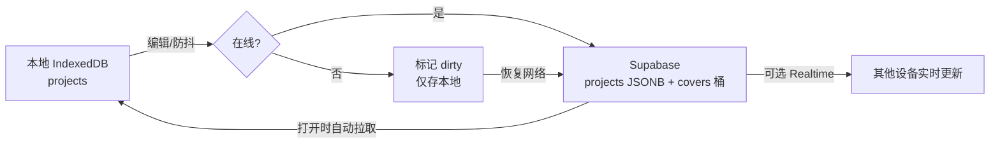

# 简单 PRD：论坛/聊天体小说编辑器 — 登录与云端同步（增量）

> 版本：v0.1（轻量版，不含竞品分析、不含实现代码）
> 作者：许清楚（产品经理）
> 日期：2025-07-14
> 关联交付物：`D:\Z\yige\forum-novel-editor\index.html`（单文件，需增量改造）
> 已锁定决策：方案 A（保留单 HTML + 新增 Supabase 浏览器客户端）；邮箱+密码登录；本地 IndexedDB 缓存 + 防抖自动推送 + 打开时拉取；个人使用整篇 last-write-wins；Supabase 项目 `cfydrjhkwmlctsmitcav.supabase.co`；表 `profiles` / `projects`(JSONB) / `covers` 桶；RLS `owner_id = auth.uid()`。

---

## 一、产品目标

在**不改动现有编辑器任何已有功能**的前提下，为单文件 Web 应用增量引入「邮箱账号体系 + 云端同步」能力：用户用邮箱注册登录后，本地 IndexedDB 中的全部项目（论坛体 / 聊天体）可一键迁移上云；之后编辑过程以「防抖自动推送 + 打开时自动拉取」实现无缝跨设备同步；离线时照常编辑、联网后自动补传，登出后本地数据仍保留可供离线浏览。整体以个人使用为场景，冲突采用整篇 last-write-wins，优先保证「打开即用、改了就存、换设备不丢」。

---

## 二、用户故事

1. **注册登录**：作为一名新用户，我希望用邮箱 + 密码注册并登录，以便把我的小说项目安全地存到云端、跨设备访问。
2. **首次本地数据迁移上云**：作为一名已在本地用过编辑器的老用户，我登录后希望系统提示并一键把 IndexedDB 里的现有项目迁移到云端，以免重传或丢失历史作品。
3. **日常编辑自动同步**：作为一名登录用户，我每次编辑（增删楼层/消息、改封面）后希望系统在短暂防抖后自动把最新内容推送到云端，以便其他设备能拿到最新版本，无需手动操作。
4. **离线编辑后联网补传**：作为一名在地铁/弱网环境写作的用户，我离线时也能正常编辑并保存到本地；网络恢复后系统自动把改动补传到云端，以便我不丢失任何一段灵感。
5. **换设备继续编辑**：作为一名在多台设备（家里电脑 / 公司电脑 / 手机）写作的用户，我在任意设备打开 URL 登录后，希望自动拉取到云端最新项目列表与内容，以便无缝接着上次进度继续写。

（可选补充）**登出后仍可离线查看**：作为一名注重隐私 / 常出差的用户，我登出后希望本地 IndexedDB 仍保留项目数据，以便无网时也能翻阅已写内容。

---

## 三、需求池

### P0（必须，首批交付）

- **P0-1 邮箱注册**：提供注册入口，邮箱 + 密码（Supabase Auth 原生），含基础格式/强度校验与重复注册提示。
- **P0-2 邮箱登录**：邮箱 + 密码登录；登录失败给出明确错误（密码错 / 用户不存在 / 网络异常）。
- **P0-3 登出**：提供登出按钮，清掉会话凭据，**但保留本地 IndexedDB 数据不删除**。
- **P0-4 会话保持（刷新不掉线）**：利用 Supabase Auth 的会话持久化（localStorage 中的 refresh token），页面刷新 / 重开后自动恢复登录态，无需重新输入。
- **P0-5 本地 → 云端首次迁移**：登录后检测本地 IndexedDB 是否有未上云项目；若有，弹出「首次迁移」提示，用户确认后逐条上传到 `projects` 表；迁移可取消、可查看进度。
- **P0-6 自动同步（防抖推送）**：在现有 `scheduleSave` 防抖基础上叠加一次云端推送（debounce，如 1.5–3s 无新改动即推送）；失败则进入重试 / 排队。
- **P0-7 手动「立即同步」按钮**：在编辑器 / 首页提供手动同步入口，强制触发一次云端推送 + 拉取。
- **P0-8 在线 / 离线 / 同步中状态指示**：顶部固定状态条，三态——在线（绿）、离线（灰/红）、同步中（转圈）；实时反映网络与同步状态。
- **P0-9 打开时自动拉取最新**：应用启动 / 进入项目时，若在线则拉取云端该项目最新版本并合并到本地视图；离线则直接读本地。
- **P0-10 RLS 安全约束**：`projects` / `profiles` 表与 `covers` 桶**必须开启 RLS**，策略 `owner_id = auth.uid()`；严禁无 RLS 裸奔。
- **P0-11 现有功能 100% 保留**：论坛体（楼主帖 / 楼层 / 图片 / 顺序 / 封面 / 设置 / 导出 JSON · 可编辑 HTML · 长图）、聊天体（会话列表 / 单聊群聊 / 成员 / 消息流 / 封面 / 设置 / 导出）全部行为不变，仅增量叠加登录与同步 UI 与逻辑。

### P1（应该，首版尽量包含）

- **P1-1 封面图走 Storage 同步**：封面图上传至 `covers` 存储桶（路径 `{owner_id}/{project_id}/{file}`），项目内容中以 Storage 引用（path / URL）替代或补充原内联 dataUrl；本地 IndexedDB 仍缓存 dataUrl 供离线渲染。
- **P1-2 冲突处理（last-write-wins）**：个人使用，整篇以 `updated_at` 较新者胜出；拉取时若本地有未推送改动，以云端时间戳为准覆盖并提示；不做字段级合并。
- **P1-3 忘记密码流程**：提供「忘记密码」入口，通过 Supabase Auth 默认重置邮件（或自接邮件，见待确认）发送重置链接。
- **P1-4 同步失败重试与离线队列**：推送失败时本地标记 dirty，联网后自动补传；给出「N 条待同步」提示。

### P2（可选 / 增强）

- **P2-1 Realtime 实时多端更新**：可选开启 Supabase Realtime，当同一账号在其他设备改动时，当前设备无需刷新即收到更新提示 / 自动刷新（需确认是否首批做）。
- **P2-2 多端「正在编辑」提示**：轻量 presence，提示「另一设备正在编辑」。
- **P2-3 同步历史 / 版本回溯**：保留最近若干版本快照，支持回滚（个人场景优先级低）。
- **P2-4 登出后「清除本地缓存」选项**：在保留默认之上，提供主动清理本地数据的隐私选项。

---

## 四、UI 设计稿

### 4.1 登录界面（新增，应用首屏，未登录时展示）

```
┌──────────────────────────────────────┐
│          📖 小说编辑器                 │
│                                        │
│   邮箱:  [______________________]       │
│   密码:  [______________________]       │
│                                        │
│   [   登录   ]   [ 注册 ]               │
│                                        │
│   [ 忘记密码？ ]                        │
│                                        │
│   —— 或继续离线使用（本地数据） ——     │
│   [   进入离线模式   ]                  │
│                                        │
│   状态: 在线● / 离线●                  │
└──────────────────────────────────────┘
```

要点：
- 未登录默认进入登录界面；同时保留「离线模式」入口，保证**不登录也能用现有编辑器**（强约束：不破坏无账号体验）。
- 登录 / 注册切换；错误内联提示。

### 4.2 顶部同步状态条（新增，登录后常驻）

位置：首页与编辑器顶部固定条，右侧或居中。

```
┌──────────────────────────────────────────────────────┐
│  🏠 我的项目      [●在线] [⟳同步中…] [☁立即同步]      │   ← 首页
│  ← 返回  项目名  [●在线·已同步] [☁立即同步]  ⚙ 导出 ▾ │   ← 编辑器
└──────────────────────────────────────────────────────┘
```

状态三态：
- **● 在线（绿）**：已连网且云地一致
- **● 离线（灰/红）**：无网络，编辑仅存本地
- **⟳ 同步中（黄 + 转圈）**：正在推送 / 拉取
- 附属「☁ 立即同步」按钮（P0-7）；离线时按钮禁用并提示「恢复网络后自动同步」。

### 4.3 首次迁移提示弹窗（新增，登录后首次检测本地有数据时）

```
┌──────────────────────────────────────────┐
│  发现本地作品                               │
│                                            │
│  检测到您本地有 N 个项目尚未上传到云端。    │
│  是否立即同步到您的账号？                   │
│                                            │
│  [ 全部迁移上云 ]  [ 仅迁移选中的 ] [ 跳过 ]│
│                                            │
│  进度: ▓▓▓▓▓▓░░ 3/N                         │
└──────────────────────────────────────────┘
```

要点：
- 仅在「本地有数据 且 云端为空 / 部分缺失」时出现一次；可跳过（跳过则后续仍可在「立即同步」中补传）。
- 迁移逐条进行，显示进度与成功 / 失败；失败项可重试。

### 4.4 数据流（Mermaid）



---

## 五、待确认问题（开放项，需用户 / 团队决策）

1. **静态托管选哪家？** GitHub Pages / Netlify / CloudStudio 三选一（影响自定义域名、构建发布方式、是否需要 CI）。
2. **Realtime 是否首批做？** P2-1 默认建议放第二批，先跑通「防抖自动同步 + 手动同步」；确认是否要进首批。
3. **忘记密码邮件**用 Supabase 默认重置邮件模板，还是自接邮件服务（自定义文案 / 品牌）？
4. **封面图存储策略**：现有封面为内联 dataUrl，是否统一改为「上传 covers 桶 + 本地缓存 dataUrl」双写（P1-1）？还是首版先用 dataUrl 内联进 JSONB（更简单），封面独立同步后置？
5. **首次迁移冲突 / 重复**：若用户多设备各自已有本地项目再登录，是否允许同名项目并存（加设备后缀）还是按 `updated_at` 覆盖？
6. **covers 桶权限**：公开读（CDN 直链、省流量）还是私有读（需签名 URL）？影响分享 / 导出长图时封面加载方式。
7. **数据删除一致性**：云端删除项目时，是否同步删除 covers 桶中对应图片（存储回收）？

---

> 约束自检：本 PRD 为增量需求，未对现有编辑器（论坛体 / 聊天体）任何既有功能提出删改，仅叠加登录与同步相关条目（见 P0-11）。全文为文档产出，不含任何实现代码。
